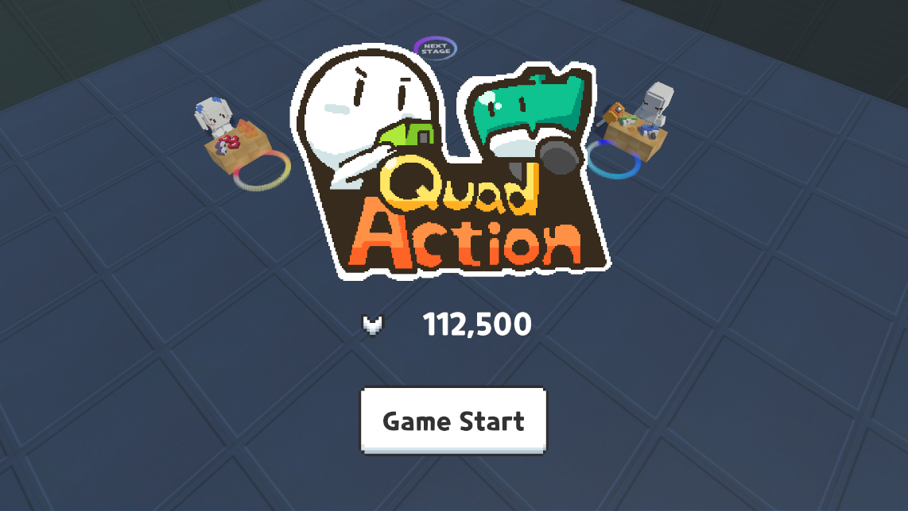
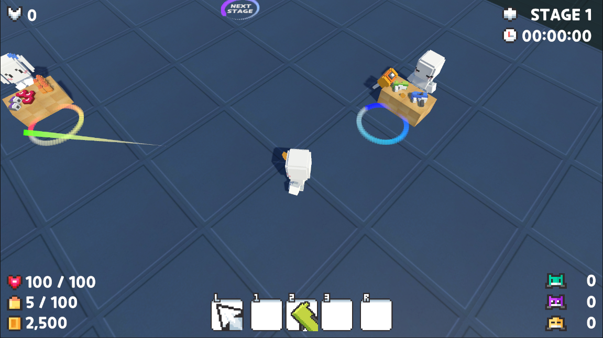
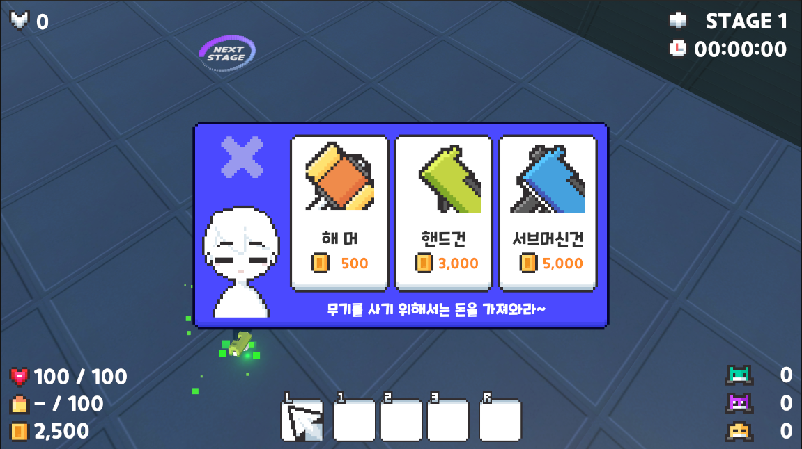
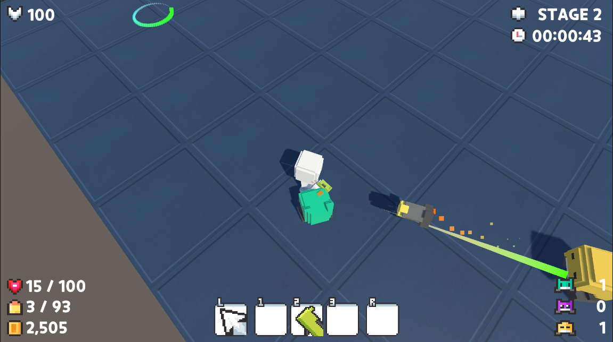

# **QuadAction**
##### - From. Gold Metal -

<!--목차-->
## **목차**
- [**Project**](#project)
    - [Genre](#genre)
    - [Explanation](#explanation)
    - [Techniques](#techniques)
- [**Scene**](#scene)
    - [Save Point](#save-point)
    - [Shop](#shop)
    - [Combat](#combat)
    - [Dead](#dead)
- [**Package**](#package)
- [**Contact**](#contact)

<!--프로젝트 설명-->
## 📁**Project**
- 해당 프로젝트는 Unity의 3D 개발에 공부하기 위해 진행한 프로젝트입니다.
- 유튜버 **Gold Metal**님의 '**유니티 3D 쿼터뷰 액션게임 [BE5]**'강의를 들으면서 공부했습니다.

### 💡**Genre**
- **Action Game**

### 📖**Explanation**
- Stage 만큼 적이 나타나며 5단위로 보스가 등장합니다.
- 각 몬스터는 코인을 드랍하며 SavePoint에서 코인을 통해 무기 및 아이템을 구매할 수 있습니다.

### 💻**Techniques**
- [**Unity**]
-> Ver 2021.3.23f1
- [**C#**]
- [**Visual Studio**]

## 🎬**Scene**
### **Save Point**

###### **UI**
- 좌측 상단 : Score
- 우측 상단 : Stage
- 좌측 하단 : Player State
- 우측 하단 : Enemy Count

###### **Explanation**
- 무기 / 아이템 상점 이용 및 휴식이 가능합니다.
- 스테이지 이동 및 다음 스테이지로 이동이 가능합니다.

 

### **Shop**

###### **Explanation**
- 상점을 이용할 때 나오는 UI 입니다.
- 각 상점에 존재하는 아이템 구매가 가능하며, 코인이 없거나 부족할 경우 하단 문구가 바뀝니다.
- 현재 UI는 카메라의 화면 아래 존재하며 상점 NPC의 전방에 충돌할 경우 올라오게 됩니다.

 

### **Combat**

###### **Explanation**
- 전투에 예시 사진입니다.
- 몬스터를 잡으면 점수가 올라가며 현재 스테이지에 존재하는 몬스터 별 카운트가 조정됩니다.
- 몬스터가 죽을 경우 Collision OFF와 Material의 Color 변화, 후방으로 날아가도록 힘 전달이 됩니다.

 

### **Dead**

###### **Explanation**
- 플레이어가 사망하는 경우 나타나는 화면입니다.
- 플레이어가 몬스터를 잡으며 얻은 점수가 기록되며 최고점인 경우 Best! text가 나타나게 됩니다.
- 버튼을 누를 경우 메인 타이틀로 이동되며 최고기록 점수는 메인 타이틀에 갱신됩니다.

<!-- 사용한 패키지 -->
## 📒**Package**
- 모델링의 경우 Asset Store의 제품을 이용하였습니다.
- Quarter View 3D Action Assets Pack (from. GoldMetal)

<!--접근-->
## 📫**Contact**
- 📧  **wodnd565@gmail.com**
- 📞  **010 - 5657 - 4813**

